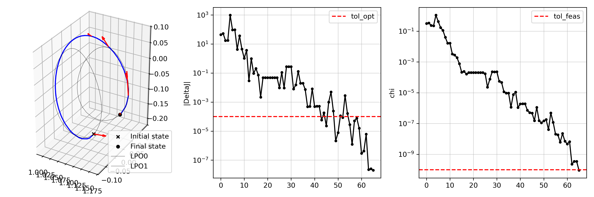

# scocp
Sequential convexified optimal control problem (scocp) solver in python

## Examples

### Impulsive Transfer Between Libration Point Orbits

The following example demonstrates an impulsive transfer between two libration point orbits in the circular restricted three-body problem.

