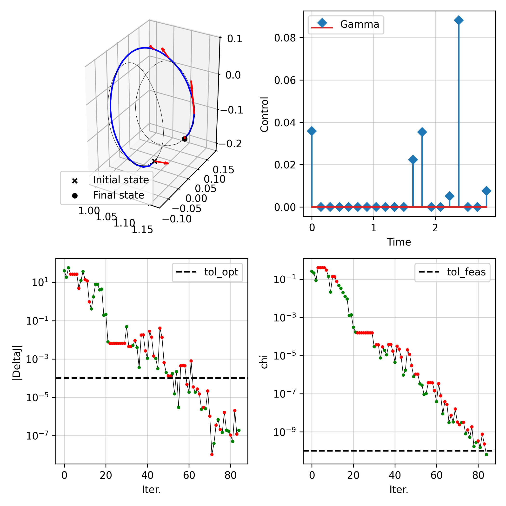
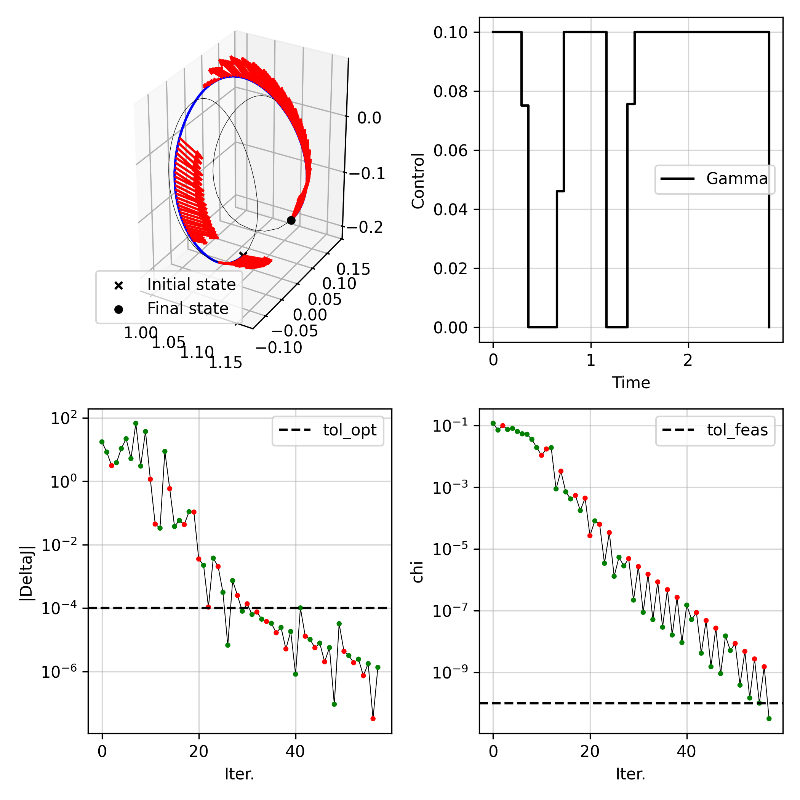
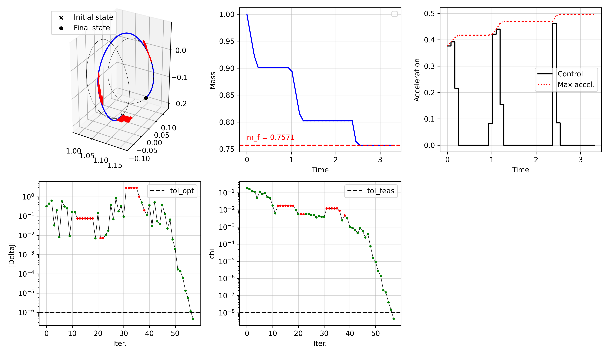

# scocp


**Sequential convexified optimal control problem (scocp) solver in python**

`scocp` is a pythononic framework for solving optimal control problems (OCPs) of the form:

```math
\begin{align}
\min_{x,u} \quad& \int_{t_0}^{t_f} \mathcal{L}(x(t),u(t),t) \mathrm{d}t
\\ \mathrm{s.t.} \quad&     \dot{x}(t) = f(x(t),u(t),t)
\\&     g(x(t),u(t),t) = 0
\\&     h(x(t),u(t),t) \leq 0
\\&     x(t_0) \in \mathcal{X}(t_0) ,\,\, x(t_f) \in \mathcal{X}(t_f)
\\&     x(t) \in \mathcal{X}(t),\,\, u(t) \in \mathcal{U}(t)
\end{align}
```

with either fixed or free $t_f$ via sequential convex programming (SCP).
The SCP is solved with the `SCvx*` algorithm, an augmented Lagrangian framework to handle non-convex constraints [1].

The dynamics in the OCP are handled by defining an integrator class, which requires a `solve(tspan, x0, u=None,stm=False)` method.
`scocp` provides wrappers to be used with either `scipy`'s [`solve_ivp()` method](https://docs.scipy.org/doc/scipy/reference/generated/scipy.integrate.solve_ivp.html) or [`heyoka`](https://bluescarni.github.io/heyoka.py/index.html), but a user-defined integrator class can be used instead as well.

To solve an OCP, the user needs to define a problem class, for example:

```python
class ImpulsiveControlProblem(scocp.ContinuousControlSCOCP):
    def __init__(self, *args, **kwargs):
        super().__init__(*args, **kwargs):
        return

    def evaluate_objective(self, xs, us, gs):
        """Evaluate the objective function"""
        # (compute objective)
        return objective
    
    def solve_convex_problem(self, xbar, ubar, gbar):
        N,nx = xbar.shape
        xs = cp.Variable((N, nx), name='state')
        us = cp.Variable((N, nu), name='control')
        gs = cp.Variable((N, 1),  name='Gamma')
        xis_dyn = cp.Variable((N-1,nx), name='xi_dyn')   # slacks for dynamics constraints
        xis     = cp.Variable(self.ng, name='xi')        # slacks for non-dynamics equality constraints
        zetas   = cp.Variable(self.nh, name='xi')        # slacks for inequality constraints
        # (formulate & solve OCP)
        return xs.value, us.value, gs.value, xis.value, xis.value, zetas.value

    def evaluate_nonlinear_constraints(self, xs, us, gs):
        g_eval = ...        # array of nonlinear equality constraints evaluated along `xs`, `us`, `gs`
        h_eval = ...        # array of nonlinear inequality constraints evaluated along `xs`, `us`, `gs`
        return g_eval, h_eval
```

In addition, we provide problem classes that can be readily used for typical OCPs in astrodynamics: 

- Fixed-time continuous rendezvous's: `FixedTimeContinuousRendezvous`, `FixedTimeContinuousRendezvousLogMass`
- Fixed-time impulsive rendezvous's: `FixedTimeImpulsiveRendezvous`


### References

[1] K. Oguri, “Successive Convexification with Feasibility Guarantee via Augmented Lagrangian for Non-Convex Optimal Control Problems,” in 2023 62nd IEEE Conference on Decision and Control (CDC), IEEE, Dec. 2023, pp. 3296–3302. doi: 10.1109/CDC49753.2023.10383462.

## Setup

1. `git clone` this repository

2. Setup virtual environment (requirements: `python 3.11`, `cvxpy`, `heyoka`, `numba`, `numpy`, `matplotlib`, `scipy`)

3. Run test from the root of the repository (requires `pytest`)

```
pytest tests
```


## Examples

**Impulsive control rendez-vous between libration point orbits**



**Continuous control rendez-vous between libration point orbits**



**Continuous control rendez-vous between libration point orbits with mass dynamics**


