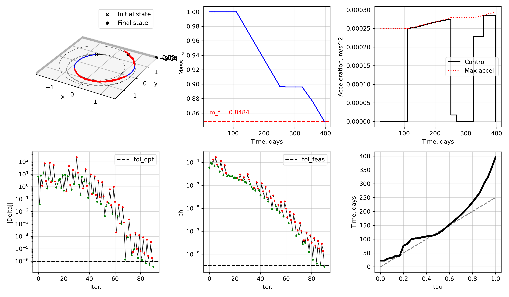

# Pykep Compatible Problems

The `scocp_pykep` extension provides OCP classes that are made to be compatible with `pykep`'s `planet` module to define initial/final rendez-vous conditions.

> [!NOTE]
> Using the classes defined hereafter requires installing `scocp_pykep` as well as `scocp`. In fact, `scocp_pykep` has `scocp` as one of its dependencies.


## Planet-to-planet rendez-vous

We consider a problem where:

- the initial and final conditions are to rendez-vous with planets following Keplerian motion around the central body (a star);
- the initial mass (wet mass) is fixed, and the objective is to maximize the final mass;
- at departure and arrival, a v-infinity vector with a user-defined upper-bound on magnitude may be used;
- the departure time from the initial planet and the arrival time are free and bounded;

This is analogous to [`pykep.trajopt.direct_pl2pl`](https://esa.github.io/pykep/documentation/trajopt.html#pykep.trajopt.direct_pl2pl).

### Mathematical model

Mathematically, the problem is given by

```{math}
\begin{aligned}
\min_{\boldsymbol{x},\boldsymbol{u},t_0,t_N,\Delta\boldsymbol{v}_{\infty,0},\Delta\boldsymbol{v}_{\infty,N}} \quad& m_N
\\ \text{s.t.}\quad&
    \boldsymbol{x}_{k+1} = \boldsymbol{f}(\boldsymbol{x}_k, \boldsymbol{u}_k, t_k, t_{k+1}) \quad k=1,\ldots,N-1
\\&
    \boldsymbol{x}_1 = \boldsymbol{x}_{\mathrm{ref},0} + \begin{bmatrix} \boldsymbol{0}_{3\times3} \\ \boldsymbol{I}_3 \end{bmatrix} \Delta\boldsymbol{v}_{\infty,0}
\\&
    \boldsymbol{x}_N = \boldsymbol{x}_{\mathrm{ref},N} + \begin{bmatrix} \boldsymbol{0}_{3\times3} \\ \boldsymbol{I}_3 \end{bmatrix} \Delta\boldsymbol{v}_{\infty,N}
\\&
    \| \boldsymbol{u}_k \|_2 \leq \dfrac{T_{\max}}{m_k} \quad k=1,\ldots,N
\\&
    t_{0,\min} \leq t_0 \leq t_{0,\max}
\\&
    t_{N,\min} \leq t_N \leq t_{N,\max}
\end{aligned}
```

Internally, to solve this problem, we define the augmented state and control

```{math}
\boldsymbol{x}^{\mathrm{aug}} (\tau) = \begin{bmatrix}
    x \\ y \\ z \\ v_x \\ v_y \\ v_z \\ \log{m} \\ t
\end{bmatrix}
,\quad
\boldsymbol{u}^{\mathrm{aug}} (\tau) = \begin{bmatrix}
    \boldsymbol{u} \\ s
\end{bmatrix}
,\quad
\boldsymbol{u} (\tau) = \begin{bmatrix}
    a_x \\ a_y \\ a_z
\end{bmatrix}
```

with augmented dynamics

```{math}
\dfrac{d \boldsymbol{x}^{\mathrm{aug}}}{d \tau}
= 
\begin{bmatrix}
    \boldsymbol{v} \\
    -\dfrac{\mu}{r^3}\boldsymbol{r} \\
    \boldsymbol{0}_{2\times 1}
\end{bmatrix}
+
\begin{bmatrix}
    s B\boldsymbol{u} & 0_{6 \times 1} & 0_{6 \times 1} \\
    0_{1\times 3} & 0 & -s/c_{\rm ex} \\
    0_{1\times 3} & 1 & 0
\end{bmatrix}
\begin{bmatrix}
    \boldsymbol{u} \\ s \\ \Gamma
\end{bmatrix}
,\quad \Gamma = \| \boldsymbol{u} \|_2
```

### Code

We start with the usual imports

```python
import cvxpy as cp
import matplotlib.pyplot as plt
import numpy as np
import pykep as pk

import os
import sys
# path to scocp and scocp_pykep
sys.path.append(os.path.join(os.path.dirname(os.path.abspath(__file__)), ".."))

import scocp
import scocp_pykep
```

Let's now define our physical constants, spacecraft parameters, and canonical scales. We then define the maximum thrust `Tmax` and exhaust velocity `cex` in terms of canonical scale.

> [!CAUTION]
> While `pykep` internally handles all quantities in SI units (i.e. meters and meters/second etc.), it's particularly important to scale quantities to similar orders of magnitude within the SCP. Thus, care is required with the units of the inputs to the various functions.

```python
# define canonical parameters
GM_SUN = pk.MU_SUN           # Sun GM, m^3/s^-2
MSTAR  = 800.0               # reference spacecraft mass
ISP    = 3000.0              # specific impulse, s
THRUST = 0.2                 # max thrust, kg.m/s^2
G0     = 9.81                # gravity at surface, m/s^2

DU = pk.AU                   # length scale set to Sun-Earth distance, m
VU = np.sqrt(GM_SUN / DU)    # velocity scale, m/s
TU = DU / VU                 # time scale, s

canonical_scales = scocp_pykep.CanonicalScales(MSTAR, GM_SUN, DU)

# define canonical spacecraft parameters
m0 = 1.0                                                # initial mass, in MU
isp = canonical_scales.isp_si2canonical(ISP)            # canonical specific impulse, TU
Tmax = canonical_scales.thrust_si2canonical(THRUST)     # canonical max thrust
cex = isp * G0*(TU**2/DU)                               # canonical exhaust velocity
print(f"Canonical isp: {isp:1.4e} TU, cex: {cex:1.4e} DU/TU, tmax: {Tmax:1.4e} MU.DU/TU^2")
```

```console
Canonical isp: 5.9730e-04 TU, cex: 9.8809e-01 DU/TU, tmax: 4.2158e-02 MU.DU/TU^2
```

We now define boundary conditions-related quantities for our problem, namely: the initial and final `pykep.plane` objects, the launch window bounds, final time bounds, and maximum departure/arrival v-infinities

```python
# define initial and final planets
pl0 = pk.planet.jpl_lp('earth')
plf = pk.planet.jpl_lp('mars')

t0_mjd2000_bounds = [1100.0, 1200.0]    # initial epoch in mjd2000
TU2DAY = TU / 86400.0                   # convert non-dimensional time to elapsed time in days

# define transfer problem discretization
tf_bounds = np.array([100.0, 500.0]) / TU2DAY
t0_guess = 0.0                          # initial guess for elapsed time at departure
tf_guess = 250.0 / TU2DAY
N = 30
s_bounds = [0.01*tf_guess, 10*tf_guess]

# max v-infinity vector magnitudes
vinf_dep = 1e3 / VU     # 1000 m/s
vinf_arr = 500 / VU     # 500 m/s
```

We can now define the continuous control two-body dynamics integrator for the augmented state with dilated time (i.e. in {math}`\tau \in [0,1]` space) and in canonical scales

```python
integrator_01domain = scocp.ScipyIntegrator(
    nx=8,
    nu=4,
    nv=1,
    rhs=scocp.control_rhs_twobody_logmass_freetf,
    rhs_stm=scocp.control_rhs_twobody_logmass_freetf_stm,
    impulsive=False,
    args=((canonical_scales.mu, cex), [0.0,0.0,0.0,1.0,0.0]),
    method='DOP853', reltol=1e-12, abstol=1e-12
)
```

We can now define the SCOCP via the function `scocp_pykep.scocp_pl2pl`. Note we need the following inputs:

- `integrator_01domain` class, as defined above
- `canonical_scales` class, as defined above
- `pl0` is the initial `pykep.planet`
- `plf` is the final `pykep.planet`
- `m0` is the initial mass (wet mass), **in canonical mass unit MU**
- `Tmax` is the maximum thrust, **in canonical units MU.DU/TU^2**
- `cex` is the exhaust velocity, **in canonical units DU/TU**
- `N` is the number of segments
- `t0_mjd2000_bounds` is the bounds for the departure epoch, **in MJD2000 (days)**
- `tf_bounds` is the bounds on the final time, **in canonical unit TU**
- `s_bounds` is the bounds on the dilation factor, **in canonical unit TU**
- `vinf_dep` is the max departure v-infinity magnitude, **in canonical units DU/TU**
- `vinf_arr` is the max arrival v-infinity magnitude, **in canonical units DU/TU**
- `weight` parameter is the initial penalty on constraint violations (default is 100).

```python
problem = scocp_pykep.scocp_pl2pl(
    integrator_01domain,
    canonical_scales,
    pl0,
    plf,
    m0,
    Tmax,
    cex,
    N,
    t0_mjd2000_bounds,
    tf_bounds,
    s_bounds,
    vinf_dep,
    vinf_arr,
    weight = 100.0,
)
```

The SCvx* algorithm needs an initial guess.
One way to supply an initial guess is to linearly interpolate the initial and final orbital elements (i.e. at the planets)

```python
xbar, ubar, vbar = problem.get_initial_guess(t0_guess, tf_guess)
```

We can now setup the SCvx* algorithm and solve our problem

```python
tol_feas = 1e-10
tol_opt = 1e-6
algo = scocp.SCvxStar(problem, tol_opt=tol_opt, tol_feas=tol_feas, rho1=1e-8, r_bounds=[1e-10, 10.0])
solution = algo.solve(
    xbar,
    ubar,
    vbar,
    maxiter = 200,
    verbose = True
)
```

```console
|  Iter  |     J0      |   Delta J   |   Delta L   |    chi     |     rho     |     r      |   weight   | step acpt. |
     1   |  5.9315e-01 |  6.3606e+00 |  6.3908e+00 | 3.4605e-02 |  9.9528e-01 | 1.0000e-01 | 1.0000e+02 |    yes     |
     2   |  2.9315e-01 |  1.6428e-01 |  4.5551e+00 | 9.8267e-02 |  3.6066e-02 | 3.0000e-01 | 2.0000e+02 |    yes     |
     3   | -6.8528e-03 |  6.9916e+00 |  2.0730e+01 | 7.7104e-02 |  3.3727e-01 | 3.0000e-01 | 4.0000e+02 |    yes     |
     4   | -6.5069e-02 | -4.6447e+00 |  1.3725e+01 | 1.8512e-01 | -3.3841e-01 | 3.0000e-01 | 4.0000e+02 |    no      |
     5   | -7.7595e-03 |  1.2637e+01 |  1.3582e+01 | 5.0969e-02 |  9.3047e-01 | 1.5000e-01 | 4.0000e+02 |    yes     |
     6   | -5.3940e-02 | -6.9003e+01 |  1.1423e+00 | 2.9570e-01 | -6.0406e+01 | 4.5000e-01 | 4.0000e+02 |    no      |
     7   | -4.1661e-04 | -2.2868e+00 |  1.0405e+00 | 5.4044e-02 | -2.1978e+00 | 2.2500e-01 | 4.0000e+02 |    no      |
     
     ...
     
    97   |  1.9111e-01 | -1.5384e-07 |  3.5754e-07 | 9.8609e-13 | -4.3026e-01 | 6.1938e-07 | 3.5184e+15 |    no      |
    98   |  1.9111e-01 | -4.1361e-08 |  3.2091e-07 | 5.7877e-12 | -1.2889e-01 | 3.0969e-07 | 3.5184e+15 |    no      |
    99   |  1.9111e-01 | -3.3555e-07 |  2.9558e-07 | 1.2339e-11 | -1.1352e+00 | 1.5484e-07 | 3.5184e+15 |    no      |
   100   |  1.9111e-01 |  2.6663e-07 |  2.8595e-07 | 9.3903e-12 |  9.3241e-01 | 7.7422e-08 | 3.5184e+15 |    yes     |


    SCvx* algorithm summary:
        Status                          : Optimal
        Objective value                 : 1.91111361e-01
        Penalized objective improvement : 2.66627415e-07 (tol: 1.0000e-06)
        Constraint violation            : 9.39026634e-12 (tol: 1.0000e-10)
        Total iterations                : 100
        SCvx* algorithm time            : 15.2741 seconds
```

Let's check that it has been solved correctly

```python
xopt, uopt, vopt, yopt, sols, summary_dict = solution.x, solution.u, solution.v, solution.y, solution.sols, solution.summary_dict
assert summary_dict["status"] == "Optimal"
assert summary_dict["chi"][-1] <= tol_feas
print(f"Initial guess TOF: {tf_guess*TU2DAY:1.4f}d --> Optimized TOF: {xopt[-1,7]*TU2DAY:1.4f}d (bounds: {tf_bounds[0]*TU2DAY:1.4f}d ~ {tf_bounds[1]*TU2DAY:1.4f}d)")
x0 = problem.target_initial.target_state(xopt[0,7])
xf = problem.target_final.target_state(xopt[-1,7])

# evaluate v-infinity vectors
vinf_dep_vec, vinf_arr_vec = yopt[0:3], yopt[3:6]
print(f"||vinf_dep|| = {np.linalg.norm(vinf_dep_vec)*VU:1.4f} m/s (max: {vinf_dep*VU:1.4f} m/s), ||vinf_arr|| = {np.linalg.norm(vinf_arr_vec)*VU:1.4f} m/s (max: {vinf_arr*VU:1.4f} m/s)")

# evaluate nonlinear violations
geq_nl_opt, sols = problem.evaluate_nonlinear_dynamics(xopt, uopt, vopt, steps=20)
print(f"Max dynamics constraint violation: {np.max(np.abs(geq_nl_opt)):1.4e}")
assert np.max(np.abs(geq_nl_opt)) <= tol_feas
```

```console
Initial guess TOF: 250.0000d --> Optimized TOF: 351.0990d (bounds: 100.0000d ~ 500.0000d)
||vinf_dep|| = 1000.0000 m/s (max: 1000.0000 m/s), ||vinf_arr|| = 500.0000 m/s (max: 500.0000 m/s)
```

Let's plot our results

```python
# initial and final orbits
initial_orbit_states = problem.get_initial_orbit()
final_orbit_states = problem.get_final_orbit()

# plot results
fig = plt.figure(figsize=(12,7))
ax = fig.add_subplot(2,3,1,projection='3d')
ax.set(xlabel="x", ylabel="y", zlabel="z")
for (_ts, _ys) in sols_ig:
    ax.plot(_ys[:,0], _ys[:,1], _ys[:,2], '--', color='grey')
for (_ts, _ys) in sols:
    ax.plot(_ys[:,0], _ys[:,1], _ys[:,2], 'b-')
    _us_zoh = scocp.zoh_controls(problem.times, uopt, _ts)
    ax.quiver(_ys[:,0], _ys[:,1], _ys[:,2], _us_zoh[:,0], _us_zoh[:,1], _us_zoh[:,2], color='r', length=5.0)

ax.scatter(x0[0], x0[1], x0[2], marker='x', color='k', label='Initial state')
ax.scatter(xf[0], xf[1], xf[2], marker='o', color='k', label='Final state')
ax.plot(initial_orbit_states[1][:,0], initial_orbit_states[1][:,1], initial_orbit_states[1][:,2], 'k-', lw=0.3)
ax.plot(final_orbit_states[1][:,0], final_orbit_states[1][:,1], final_orbit_states[1][:,2], 'k-', lw=0.3)
ax.set_aspect('equal')
ax.legend()

ax_m = fig.add_subplot(2,3,2)
ax_m.grid(True, alpha=0.5)
for (_ts, _ys) in sols:
    ax_m.plot(_ys[:,7]*canonical_scales.TU2DAY, np.exp(_ys[:,6]), 'b-')
ax_m.axhline(np.exp(sols[-1][1][-1,6]), color='r', linestyle='--')
ax_m.text(xopt[0,7]*canonical_scales.TU2DAY, 0.01 + np.exp(sols[-1][1][-1,6]), f"m_f = {np.exp(sols[-1][1][-1,6]):1.4f}", color='r')
ax_m.set(xlabel="Time, days", ylabel="Mass")
#ax_m.legend()

ax_u = fig.add_subplot(2,3,3)
ax_u.grid(True, alpha=0.5)
ax_u.step(xopt[:,7]*canonical_scales.TU2DAY, np.concatenate((vopt[:,0], [0.0])), label="Control", where='post', color='k')
for idx, (_ts, _ys) in enumerate(sols):
    ax_u.plot(_ys[:,7]*canonical_scales.TU2DAY, Tmax/np.exp(_ys[:,6]), color='r', linestyle=':', label="Max accel." if idx == 0 else None)
ax_u.set(xlabel="Time, days", ylabel="Acceleration")
ax_u.legend()

ax_DeltaJ = fig.add_subplot(2,3,4)
ax_DeltaJ.grid(True, alpha=0.5)
algo.plot_DeltaJ(ax_DeltaJ, summary_dict)
ax_DeltaJ.axhline(tol_opt, color='k', linestyle='--', label='tol_opt')
ax_DeltaJ.legend()

ax_DeltaL = fig.add_subplot(2,3,5)
ax_DeltaL.grid(True, alpha=0.5)
algo.plot_chi(ax_DeltaL, summary_dict)
ax_DeltaL.axhline(tol_feas, color='k', linestyle='--', label='tol_feas')
ax_DeltaL.legend()

ax = fig.add_subplot(2,3,6)
for (_ts, _ys) in sols_ig:
    ax.plot(_ts, _ys[:,7]*canonical_scales.TU2DAY, '--', color='grey')
for (_ts, _ys) in sols:
    ax.plot(_ts, _ys[:,7]*canonical_scales.TU2DAY, marker="o", ms=2, color='k')
ax.grid(True, alpha=0.5)
ax.set(xlabel="tau", ylabel="Time, days")
plt.tight_layout()
```


