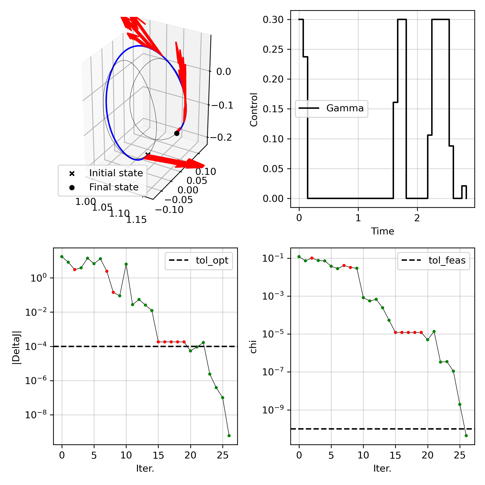

# Tutorials

## Setting up the dynamics

We first need to define the dynamics. 
As an example, we will assume we want to solve a fixed-time, continuous control rendez-vous problem in the CR3BP.
We will define a `scocp.ScipyIntegrator` class. Note that instead, we could have constructed a `scocp.HeyokaIntegrator` class. 

First, we need to construct two equations of motion: one to propagate the state, and another to propagate the state and state-transition matrices.
As a convention, the *last* parameter is expected to be the control vector `u`. If building a `heyoka` integrator, make sure the parameters `hy.par[:]` is the control vector `u`.

To define the first equations of motion for the state with control, `control_rhs_cr3bp`, let's first define the natural dynamics `rhs_cr3bp`

```python
def rhs_cr3bp(t, state, mu):
    """Equation of motion in CR3BP, formulated for scipy.integrate.solve=ivp(), compatible with njit

    Args:
        t (float): time
        state (np.array): 1D array of Cartesian state, length 6
        mu (float): CR3BP parameter

    Returns:
        (np.array): 1D array of derivative of Cartesian state
    """
    # unpack positions
    x = state[0]
    y = state[1]
    z = state[2]
    # unpack velocities
    vx = state[3]
    vy = state[4]
    vz = state[5]
    # compute radii to each primary
    r1 = np.sqrt((x + mu) ** 2 + y ** 2 + z ** 2)
    r2 = np.sqrt((x - 1 + mu) ** 2 + y ** 2 + z ** 2)
    # setup vector for dX/dt
    deriv = np.zeros((6,))
    # position derivatives
    deriv[0] = vx
    deriv[1] = vy
    deriv[2] = vz
    # velocity derivatives
    deriv[3] = (
        2 * vy + x - ((1 - mu) / r1 ** 3) * (mu + x) + (mu / r2 ** 3) * (1 - mu - x)
    )
    deriv[4] = -2 * vx + y - ((1 - mu) / r1 ** 3) * y - (mu / r2 ** 3) * y
    deriv[5] = -((1 - mu) / r1 ** 3) * z - (mu / r2 ** 3) * z
    return deriv
```

and now the controlled eom

```python
def control_rhs_cr3bp(t, state, mu, u):
    """Equation of motion in CR3BP with continuous control in the rotating frame"""
    # derivative of state
    B = np.concatenate((np.zeros((3,3)), np.eye(3)))
    deriv = rhs_cr3bp(t, state[0:6], mu) + B @ u[0:3]
    return deriv
```

Now, let's define the second equations of motion `control_rhs_cr3bp_stm`, which propagates both the state and the state-transition matrices

```python
def control_rhs_cr3bp_stm(t, state, mu, u):
    """Equation of motion in CR3BP with continuous control in the rotating frame with STM"""
    # derivative of state
    B = np.concatenate((np.zeros((3,3)), np.eye(3)))
    deriv = np.zeros(60)    # 6 + 6*6 + 6*3
    deriv[0:6] = rhs_cr3bp(t, state[0:6], mu) + B @ u[0:3]
    
    # derivative of STM
    Phi_A = state[6:42].reshape(6,6)
    A = np.zeros((6,6))
    A[0:3,3:6] = np.eye(3)
    A[3,4] = 2
    A[4,3] = -2
    A[3:6,0:3] = gravity_gradient_cr3bp(state[0:3], mu)
    deriv[6:42] = np.dot(A, Phi_A).reshape(36,)

    # derivative of control sensitivity
    Phi_B = state[42:60].reshape(6,3)
    deriv[42:60] = (np.dot(A, Phi_B) + B).reshape(18,)
    return deriv
```

Finally, we can construct an integrator

```python
mu = 1.215058560962404e-02
integrator = scocp.ScipyIntegrator(
    nx=6,
    nu=3,
    rhs=control_rhs_cr3bp,          # equivalent to scocp.control_rhs_cr3bp,
    rhs_stm=control_rhs_cr3bp_stm,  # equivalent to scocp.control_rhs_cr3bp_stm,
    impulsive=False,
    args=(mu,[0.0,0.0,0.0]),
    method='DOP853',
    reltol=1e-12,
    abstol=1e-12
)
```

## Building my SCOCP

Let's define some constants for our problem

```python
# propagate uncontrolled and controlled dynamics
x0 = np.array([
    1.0809931218390707E+00,
    0.0,
    -2.0235953267405354E-01,
    0.0,
    -1.9895001215078018E-01,
    0.0])
period_0 = 2.3538670417546639E+00
sol_lpo0 = integrator.solve([0, period_0], x0, get_ODESolution=True)

xf = np.array([
    1.1648780946517576,
    0.0,
    -1.1145303634437023E-1,
    0.0,
    -2.0191923237095796E-1,
    0.0])
period_f = 3.3031221822879884
sol_lpo1 = integrator.solve([0, period_f], xf, get_ODESolution=True)

# transfer problem discretization
N = 40
tf = (period_0 + period_f) / 2
times = np.linspace(0, tf, N)
umax = 0.3  # max acceleration
```

We now define a SCOCP instance, by inheriting `scocp.ContinuousControlSCOCP`.
Note the `MySCOCP` defined below is actually what's implemented as `scocp.FixedTimeContinuousRdv`, but we will explicitly define it here and see what it takes to define our own SCOCP.

```python
class MySCOCP(scocp.ContinuousControlSCOCP):
    """Fixed-time continuous rendezvous problem class"""
    def __init__(self, x0, xf, umax, *args, **kwargs):
        super().__init__(*args, **kwargs)
        assert len(x0) == 6
        assert len(xf) == 6
        self.x0 = x0
        self.xf = xf
        self.umax = umax
        return
        
    def evaluate_objective(self, xs, us, gs, ys=None):
        """Evaluate the objective function"""
        dts = np.diff(self.times)
        return np.sum(gs.T @ dts)
    
    def solve_convex_problem(self, xbar, ubar, vbar, ybar=None):
        """Solve the convex subproblem
        
        Args:
            xbar (np.array): `(N, self.integrator.nx)` array of reference state history
            ubar (np.array): `(N-1, self.integrator.nu)` array of reference control history
            vbar (np.array): `(N-1, self.integrator.nv)` array of reference constraint history
        
        Returns:
            (tuple): np.array values of xs, us, gs, xi_dyn, xi_eq, zeta_ineq
        """
        N,nx = xbar.shape
        _,nu = ubar.shape
        Nseg = N - 1
        
        xs = cp.Variable((N, nx), name='state')
        us = cp.Variable((Nseg, nu), name='control')
        vs = cp.Variable((Nseg, 1), name='Gamma')
        xis_dyn = cp.Variable((Nseg,nx), name='xi_dyn')         # slack for dynamics
        
        penalty = get_augmented_lagrangian_penalty(self.weight, xis_dyn, self.lmb_dynamics)
        dts = np.diff(self.times)
        objective_func = cp.sum(vs.T @ dts) + penalty
        constraints_objsoc = [cp.SOC(vs[i,0], us[i,:]) for i in range(N-1)]

        if self.augment_Gamma:
            constraints_dyn = [
                xs[i+1,:] == self.Phi_A[i,:,:] @ xs[i,:] + self.Phi_B[i,:,:] @ np.concatenate([us[i,:], vs[i,:]]) + self.Phi_c[i,:] + xis_dyn[i,:]
                for i in range(Nseg)
            ]
        else:
            constraints_dyn = [
                xs[i+1,:] == self.Phi_A[i,:,:] @ xs[i,:] + self.Phi_B[i,:,:] @ us[i,:] + self.Phi_c[i,:] + xis_dyn[i,:]
                for i in range(Nseg)
            ]

        constraints_trustregion = [
            xs[i,:] - xbar[i,:] <= self.trust_region_radius for i in range(N)
        ] + [
            xs[i,:] - xbar[i,:] >= -self.trust_region_radius for i in range(N)
        ]

        constraints_initial = [xs[0,:] == self.x0]
        constraints_final   = [xs[-1,0:3] == self.xf[0:3], 
                               xs[-1,3:6] == self.xf[3:6]]
        
        constraints_control = [
            vs[i,0] <= self.umax for i in range(Nseg)
        ]

        convex_problem = cp.Problem(
            cp.Minimize(objective_func),
            constraints_objsoc + constraints_dyn + constraints_trustregion + constraints_initial + constraints_final + constraints_control)
        convex_problem.solve(solver = self.solver, verbose = self.verbose_solver)
        self.cp_status = convex_problem.status
        return xs.value, us.value, vs.value, None, xis_dyn.value, None, None
```

There are two methods that are defined (on top of the inherited methods from `scocp.ContinuousControlSCOCP`):

- `evaluate_objective`: evaluate the objective function (without any penalty)
- `solve_convex_problem`: constructs and solves the convex subproblem and returns the optimized variable values. It is expected to return 7 np.array's, corresponding to:
    1. `xs.value`: `(N,nx)` state history
    2. `us.value`: `(N-1,nu)` control history
    3. `vs.value`: `(N,self.integrator.nv)` control magnitude history (used to upper-bound control magnitudes)
    4. `ys.value`: `(ny,)` additional variables (we don't have any here, so we return `None`)
    5. `xis_dyn.value`: `(N-1,nx)` slack variables for dynamics non-convex equality constraints
    6. `xis.value`: `(ng,)` slack variables for other non-convex equality constraints (we don't have any here, so we return `None`)
    7. `zetas.value`: `(nh,)` slack variables for other non-convex equality constraints (we don't have any here, so we return `None`)

Note that by inheriting `scocp.ContinuousControlSCOCP`, we already have built-in a `build_linear_model` method which will populate the linearized matrices `self.Phi_A`, `self.Phi_B`, and `self.Phi_c` to define our linearized dynamics constraints!

Here, we assume we have no non-convex constraints besides the dynamics equality constraints, so we do not need to define an `evaluate_nonlinear_constraints` method.


## Solving my SCOCP

Let's now go over solving the above problem. We first need to construct some initial guess

```python
# create initial guess
sol_initial = integrator.solve([0, times[-1]], x0, t_eval=times, get_ODESolution=True)
sol_final  = integrator.solve([0, times[-1]], xf, t_eval=times, get_ODESolution=True)

alphas = np.linspace(1,0,N)
xbar = (np.multiply(sol_initial.y, np.tile(alphas, (6,1))) + np.multiply(sol_final.y, np.tile(1-alphas, (6,1)))).T
xbar[0,:] = x0  # overwrite initial state
xbar[-1,:] = xf # overwrite final state
ubar = np.zeros((N-1,3))
```

Let's see if we can solve our convex subproblem (this is not a necessary step, but just for sanity check!)

```python
# solve subproblem
vbar = np.sum(ubar, axis=1).reshape(-1,1)
problem.solve_convex_problem(xbar, ubar, vbar)
assert problem.cp_status == "optimal"
```

Let's now setup the SCvx* algorithm and solve the non-convex OCP

```python
# setup algorithm & solve
tol_feas = 1e-10
tol_opt = 1e-4
algo = scocp.SCvxStar(problem, tol_opt=tol_opt, tol_feas=tol_feas, alpha2=1.5)
solution = algo.solve(
    xbar,
    ubar,
    vbar,
    maxiter = 100,
    verbose = True
)
xopt, uopt, vopt, yopt, sols, summary_dict = solution.x, solution.u, solution.v, solution.y, solution.sols, solution.summary_dict
assert summary_dict["status"] == "Optimal"
assert summary_dict["chi"][-1] <= tol_feas

# evaluate nonlinear violations
geq_nl_opt, sols = problem.evaluate_nonlinear_dynamics(xopt, uopt, vopt, steps=5)
assert np.max(np.abs(geq_nl_opt)) <= tol_feas
```

```console
|  Iter  |     J0      |   Delta J   |   Delta L   |    chi     |     rho     |     r      |   weight   | step acpt. |
     1   |  2.2739e-10 |  1.7489e+01 |  1.9742e+01 | 1.1932e-01 |  8.8587e-01 | 1.0000e-01 | 1.0000e+02 |    yes     |
     2   |  2.4175e-11 |  8.3132e+00 |  1.0340e+01 | 7.2199e-02 |  8.0398e-01 | 1.5000e-01 | 2.0000e+02 |    yes     |
     3   |  2.2398e-02 | -3.0761e+00 |  9.7306e+00 | 1.0033e-01 | -3.1612e-01 | 2.2500e-01 | 4.0000e+02 |    no      |
     4   |  2.5404e-02 |  3.8731e+00 |  9.7072e+00 | 7.4989e-02 |  3.9899e-01 | 1.1250e-01 | 4.0000e+02 |    yes     |
     5   |  1.9278e-01 |  1.4197e+01 |  2.6724e+01 | 7.1406e-02 |  5.3123e-01 | 1.1250e-01 | 8.0000e+02 |    yes     |
     6   |  1.5384e-01 |  6.8193e+00 |  1.2567e+01 | 3.7230e-02 |  5.4262e-01 | 1.1250e-01 | 8.0000e+02 |    yes     |
     7   |  2.2936e-01 |  1.3185e+01 |  1.3279e+01 | 2.7903e-02 |  9.9291e-01 | 1.1250e-01 | 1.6000e+03 |    yes     |
     8   |  2.0723e-01 | -2.4345e+00 |  1.1287e-01 | 4.0832e-02 | -2.1569e+01 | 1.6875e-01 | 1.6000e+03 |    no      |
     9   |  2.1206e-01 | -1.4361e-01 |  1.1082e-01 | 3.2106e-02 | -1.2959e+00 | 8.4375e-02 | 1.6000e+03 |    no      |
    10   |  2.1950e-01 |  8.9891e-02 |  1.0612e-01 | 2.9201e-02 |  8.4708e-01 | 4.2188e-02 | 1.6000e+03 |    yes     |

|  Iter  |     J0      |   Delta J   |   Delta L   |    chi     |     rho     |     r      |   weight   | step acpt. |
    11   |  1.9400e-01 |  6.3894e+00 |  6.4175e+00 | 8.1784e-04 |  9.9562e-01 | 6.3281e-02 | 3.2000e+03 |    yes     |
    12   |  1.9906e-01 |  2.7403e-02 |  5.8542e-02 | 5.5369e-04 |  4.6809e-01 | 9.4922e-02 | 6.4000e+03 |    yes     |
    13   |  1.9658e-01 |  5.4702e-02 |  5.4863e-02 | 6.7060e-04 |  9.9708e-01 | 9.4922e-02 | 1.2800e+04 |    yes     |
    14   |  1.9674e-01 |  2.5814e-02 |  2.9075e-02 | 2.3998e-04 |  8.8784e-01 | 1.4238e-01 | 2.5600e+04 |    yes     |
    15   |  1.9677e-01 |  1.2429e-02 |  1.3145e-02 | 5.2697e-05 |  9.4554e-01 | 2.1357e-01 | 5.1200e+04 |    yes     |
    16   |  1.9675e-01 | -1.8190e-04 |  3.5873e-04 | 1.2053e-05 | -5.0706e-01 | 3.2036e-01 | 1.0240e+05 |    no      |
    17   |  1.9675e-01 | -1.8194e-04 |  3.5873e-04 | 1.2051e-05 | -5.0716e-01 | 1.6018e-01 | 1.0240e+05 |    no      |
    18   |  1.9675e-01 | -1.8200e-04 |  3.5874e-04 | 1.2050e-05 | -5.0734e-01 | 8.0090e-02 | 1.0240e+05 |    no      |
    19   |  1.9675e-01 | -1.8189e-04 |  3.5873e-04 | 1.2050e-05 | -5.0704e-01 | 4.0045e-02 | 1.0240e+05 |    no      |
    20   |  1.9675e-01 | -1.8186e-04 |  3.5873e-04 | 1.2051e-05 | -5.0694e-01 | 2.0023e-02 | 1.0240e+05 |    no      |

|  Iter  |     J0      |   Delta J   |   Delta L   |    chi     |     rho     |     r      |   weight   | step acpt. |
    21   |  1.9676e-01 |  5.4032e-05 |  3.5172e-04 | 4.9687e-06 |  1.5362e-01 | 1.0011e-02 | 1.0240e+05 |    yes     |
    22   |  1.9676e-01 |  9.2034e-05 |  9.7191e-05 | 1.3518e-05 |  9.4694e-01 | 5.0056e-03 | 2.0480e+05 |    yes     |
    23   |  1.9675e-01 |  1.6716e-04 |  1.7028e-04 | 3.3025e-07 |  9.8173e-01 | 7.5085e-03 | 4.0960e+05 |    yes     |
    24   |  1.9675e-01 |  2.3888e-06 |  2.7693e-06 | 3.4822e-07 |  8.6259e-01 | 1.1263e-02 | 8.1920e+05 |    yes     |
    25   |  1.9675e-01 |  3.8691e-07 |  3.8721e-07 | 1.0924e-07 |  9.9922e-01 | 1.6894e-02 | 1.6384e+06 |    yes     |
    26   |  1.9675e-01 |  9.9912e-08 |  9.9900e-08 | 1.9313e-09 |  1.0001e+00 | 2.5341e-02 | 3.2768e+06 |    yes     |
    27   |  1.9675e-01 | -5.9994e-10 | -6.0173e-10 | 4.3375e-11 |  9.9703e-01 | 3.8012e-02 | 6.5536e+06 |    yes     |


    SCvx* algorithm summary:
        Status                          : Optimal
        Objective value                 : 1.96745700e-01
        Penalized objective improvement : -5.99943928e-10 (tol: 1.0000e-04)
        Constraint violation            : 4.33754005e-11 (tol: 1.0000e-10)
        Total iterations                : 27
        SCvx* algorithm time            : 3.3973 seconds
```




